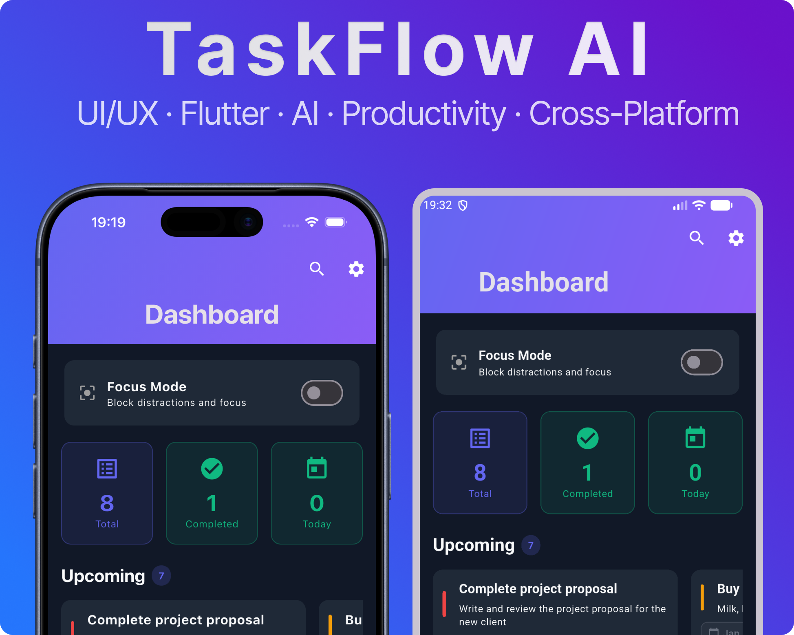

# HabitTracker 📱

> Motivational iOS app for habit tracking with gamification, advanced analytics, and numerous features

[](https://swift.org)
[](https://developer.apple.com/ios/)
[](https://developer.apple.com/xcode/swiftui/)
[](LICENSE)

A full-featured iOS application for tracking habits with a motivational system, gamification, and advanced analytics. Built using SwiftUI and following iOS development best practices.

**Author:** Rafael Mukhametov

## 📸 Screenshots

<div align="center">
  
  <p><em>Main screen with habits list and achievements view</em></p>
</div>

## ✨ Key Features

### 📝 Habit Tracking
- ✅ Create and manage habits with full customization
- ✅ Progress calendar and visualization
- ✅ Streak system (consecutive days) with animations
- ✅ Completion notes
- ✅ Categories and search/filtering (6 filter types)
- ✅ Archiving and duplicating habits
- ✅ 10 predefined habit templates

### 🏆 Gamification
- 🎮 Points and levels system
- 🎯 Challenges (30-day challenges, 5 types)
- 🏅 8 types of achievements with automatic checking
- ⭐ Badges and rewards
- 📊 Weekly review with rewards

### 📊 Analytics & Statistics
- 📈 Detailed statistics per habit
- 📉 Advanced analytics with predictions
- 🔥 Heat Map activity calendar (yearly overview)
- 🕐 Time-of-day statistics
- 💡 Personalized insights and recommendations
- 📊 Period comparison (month vs month)
- 📆 Custom periods for analysis
- 📈 Trends and forecasts based on data

### 💬 Motivation
- ✨ Daily motivational quotes (15+ quotes)
- 🔔 Customizable reminders (multiple)
- 🎉 Achievement animations
- 📱 Motivation widget on main screen
- 🎊 Personalized messages

### 💾 Export & Integrations
- 📄 Export to CSV, JSON, PDF
- 📅 iOS Calendar integration (automatic export)
- ❤️ HealthKit integration (steps, calories)
- 📤 Sharing achievements and statistics
- ☁️ Backup and restore

### 🗂️ Organization
- 📁 Habit groups (folders)
- ⚡ Habit triggers (if-then logic)
- 📋 Habit templates for quick creation
- 🎨 6 themes
- 🔍 Smart search and filtering

## 🏗️ Architecture

- **Pattern**: MVVM + Repository Pattern
- **Data Storage**: Core Data
- **UI Framework**: SwiftUI
- **Minimum Version**: iOS 16.0+
- **Language**: Swift 5.7+

## 📱 Main Screens (25 screens)

- **Main Screen** - habit grid with progress circles
- **Habit Details** - calendar, statistics, charts, Heat Map
- **Create/Edit** - full habit configuration
- **Statistics** - overall statistics and analytics
- **Profile** - progress, level, badges
- **Challenges** - participate in challenges
- **Dashboard** - overview of key metrics
- **Settings** - themes, export, backup
- And 17 more specialized screens

## 🎨 Technologies

- **SwiftUI** - modern declarative UI
- **Core Data** - data persistence
- **Combine** - reactive programming
- **Charts** - data visualization
- **UserNotifications** - local notifications
- **HealthKit** - health integration
- **EventKit** - calendar integration
- **PDFKit** - PDF report generation

## 🚀 Requirements

- iOS 16.0+
- Xcode 14.0+
- Swift 5.7+

## 🔧 Installation

### Clone the Repository

```bash
git clone https://github.com/rafaelwww07-ios/HabitTracker.git
cd HabitTracker
```

### Open the Project

```bash
open HabitTracker.xcodeproj
```

### Run

1. Select a simulator or connected device
2. Press Run (⌘R) or click the Play button

## 📦 Project Structure

Main structure:
```
HabitTracker/
├── CoreData/              # Core Data setup
├── Models/                # Data models (11 files)
├── Repository/            # Data access layer
├── Services/              # Services (15 files)
├── ViewModels/            # ViewModels for MVVM
└── Views/                 # SwiftUI Views (25 screens)
    └── Components/        # Reusable components (9)
```

## 🤝 Contributing

We welcome contributions to the project! Please read [CONTRIBUTING.md](CONTRIBUTING.md) before getting started.

## 📄 License

This project is available under the MIT license. See [LICENSE](LICENSE) for details.

## 🏷️ Tags

`swift` `swiftui` `ios` `habit-tracker` `mvvm` `core-data` `gamification` `analytics` `motivation` `productivity` `healthkit` `charts` `swiftui-charts` `habit-forming` `goal-tracking` `streaks` `achievements` `challenges`

## 📊 Project Statistics

- **68** Swift files
- **25** screens
- **15** services
- **9** reusable components
- **60+** features

## 🔮 Future Plans

- [ ] iOS home screen widgets (WidgetKit)
- [ ] Siri Shortcuts integration
- [ ] iCloud synchronization
- [ ] Social features (progress sharing)
- [ ] Dark themes with accents
- [ ] Photo attachments to completions

## 👤 Author

**Rafael Mukhametov**

Made with ❤️ using SwiftUI

---

**Note**: This is an open-source project for habit tracking. For production use, additional testing and optimization are recommended.
